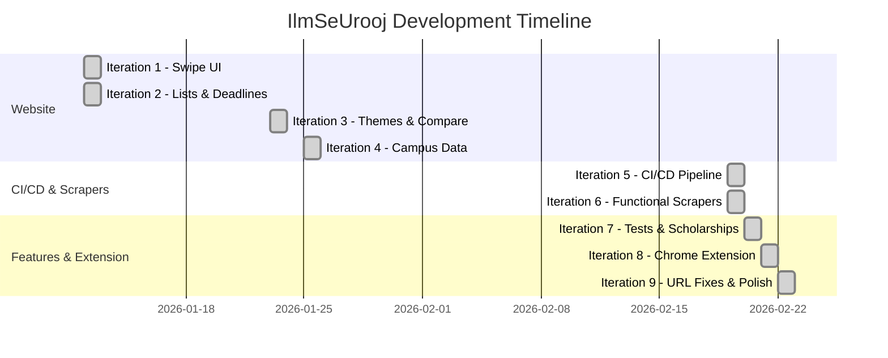

# IlmSeUrooj — Complete Development History

> Every step of building Pakistan's first university application autofill platform.

---

## Project Timeline



| # | Date | Iteration | Key Deliverable |
|---|------|-----------|-----------------|
| 1 | Jan 12 | Swipe UI | Tinder-style university browsing with 15 universities |
| 2 | Jan 12 | Lists & Deadlines | University list, field rankings, countdown timers |
| 3 | Jan 23 | Themes & Comparison | 3-theme system, department-specific comparison tool |
| 4 | Jan 25 | Campus Data | Expanded from 15 → 28 entries with campus-specific cutoffs |
| 5 | Feb 19 | CI/CD Pipeline | GitHub Actions automation with tiered scraping |
| 6 | Feb 19 | Functional Scrapers | Real scraper implementations with AST-based file updates |
| 7 | Feb 20 | Tests & Scholarships | Entry tests guide, scholarships database, UX improvements |
| 8 | Feb 21 | Chrome Extension | Full MV3 extension with 3-tier autofill engine |
| 9 | Feb 22 | URL Fixes & Polish | Corrected apply URLs, name splitting, extension detection |

---

## Iteration 1: Tinder-Style University Swiping
**Date**: January 12, 2026

### What Was Built
The core swipe-based university browsing interface — the heart of the app. Students can drag-swipe through university cards left (skip) or right (save), similar to dating apps but for universities.

### Step-by-Step
1. **Set up Next.js 14** with App Router and vanilla CSS modules
2. **Created university data file** (`src/data/universities.js`) with 15 universities
3. **Built filter system** (6 filters):
   - Field/Category (Pre-Engineering, CS, Business, Medical, Others)
   - Degree Level, Program, Hostel/Campus, City, Campus Type
4. **Built swipe interface**:
   - Touch/mouse drag gestures with color overlays
   - Save (💚) and Skip (✕) buttons
   - Match percentage based on filter compatibility
5. **Implemented ranking algorithm**:
   - Exact Program Match: 40 pts
   - Field Category Match: 30 pts
   - Campus/Hostel Match: 15 pts
   - City Match: 10 pts, Campus Type: 5 pts
6. **Styled with glass-morphism** — frosted glass cards, gradients, mobile-first

### Files Created
- `src/app/page.js` — Main page with swipe logic
- `src/data/universities.js` — 15 university entries
- `src/app/globals.css` — Global styles with dark theme

---

## Iteration 2: University Rankings & Admission Deadlines
**Date**: January 12, 2026

### What Was Built
Added a scrollable university list below the swipe area and real admission deadline data with countdown timers.

### Step-by-Step
1. **Built University List section**:
   - Expandable cards with full details (programs, facilities, fees)
   - Field-specific ranking badges (#1 in Pre-Eng, #1 in CS, etc.)
2. **Created field-specific rankings**:
   - Pre-Engineering: NUST → UET → GIKI → PIEAS → NED
   - CS: FAST → NUST → LUMS → COMSATS → IBA
   - Business: LUMS → IBA → NUST → COMSATS → Bahria
3. **Built Admissions Deadlines component**:
   - Real 2026 data from official university websites
   - Countdown timers showing days remaining
   - Urgency badges: Red (< 3 days), Orange (< 7), Yellow (< 14)
   - "Apply Now" links to official admission portals
   - Field filter to show relevant deadlines only

### Files Created
- `src/components/UniversityList/` — Expandable list component
- `src/components/AdmissionsDeadlines/` — Countdown deadline component

---

## Iteration 3: Multi-Theme System & Enhanced Comparison
**Date**: January 23, 2026

### What Was Built
Three distinct visual themes and a completely rebuilt university comparison tool with department-specific data.

### Step-by-Step
1. **Designed 3 themes**:
   - **Dark Mode** — Forest green (#2d5a3d) on deep green, eye-friendly default
   - **Light Mode** — Forest green on cream (#f8f5e9), bright environments
   - **Treasure Map** — Brown/sepia on parchment textures, thematic
2. **Built theme infrastructure**:
   - ThemeContext for global state
   - ThemeToggle component for seamless switching
   - CSS custom properties for all theme tokens
3. **Added decorative backgrounds**:
   - Position-based decorations (compass, books, graduation cap)
   - Full-page map backgrounds for treasure theme
   - Lazy-loaded, performance-optimized images
4. **Rebuilt comparison tool** with department-specific data:
   - Department filter (CS, Pre-Engineering, Business, Medical)
   - 5 comparison modes: Overall, Industry, Career, Research, Facilities
   - Per-department data for 15 universities: rankings, faculty ratings, research output, placement rates, avg salaries, top recruiters, lab facilities

### Files Created
- `src/data/departmentData.js` — Department metrics for all universities
- `src/components/Background/DecorativeImages.js` — Theme decorations
- `src/components/ThemeToggle/ThemeToggle.js` — Theme switcher
- `src/context/ThemeContext.js` — Theme state management

---

## Iteration 4: Campus-Specific Data & 28 Universities
**Date**: January 25, 2026

### What Was Built
Split multi-campus universities into individual entries. Expanded from 15 to 28 entries with campus-specific cutoffs and admission data.

### Step-by-Step
1. **Split FAST-NUCES into 5 campuses**:
   - Islamabad (73% CS cutoff), Lahore (70%), Karachi (69%), Peshawar (~53%), Chiniot (~54%)
2. **Split COMSATS into 7 campuses**:
   - Lahore (87.5%), Islamabad (87.1%), Wah (~80%), Abbottabad (78.2%), Sahiwal (~68%), Attock (~62%), Vehari (~58%)
3. **Split Bahria into 3 campuses**:
   - Islamabad (>80%), Lahore (~72%), Karachi (~68%)
4. **Split UET into 2 campuses**:
   - UET Lahore (81.65% ME cutoff), UET Taxila (~75%)
5. **Added GIKI merit position data** — closing positions instead of seat counts
6. **Built campus-specific Admission Predictor** — individual merit formulas, cutoffs, historical data, and tips per campus
7. **UI refinements** — emoji removal, deadline toggle (upcoming/elapsed), improved facility tags

### Data Research Sources
- Official university merit lists (2024)
- HEC Pakistan rankings
- Student forums (Reddit r/pakistan, Maqsad.io)
- YouTube admission result videos

---

## Iteration 5: Automated CI/CD Pipeline
**Date**: February 19, 2026

### What Was Built
A complete automated data update pipeline using GitHub Actions. The system scrapes university websites on a tiered schedule, validates data, and creates pull requests.

### Step-by-Step
1. **Built tiered scraper engine** (`scripts/scrapers/university-scraper.js`):
   - 16 scrape configurations covering all 28 universities
   - Cheerio for HTML parsing (lightweight, no headless browser)
   - Tier 1 (every 20 days): Deadlines, test dates, test names
   - Tier 2 (bimonthly): Fees, websites, descriptions
   - Rate limiting (2s delay), retry logic, graceful failure
2. **Built pipeline orchestrator** (`scripts/fetch-university-data.js`):
   - Accepts `DATA_TIER` env variable
   - Calls scraper → parses `universities.js` → merges changes
   - Generates `reports/scrape-results.json` and `reports/change-report.json`
3. **Created GitHub Actions workflow**:
   - Two-tier cron schedule
   - Manual dispatch with tier selection
   - Auto-generated PRs with labels and AI review comments
   - Artifact uploads (reports, updated data)
4. **Built 5 validator scripts**:
   - Schema validator, data comparator, integrity checker, target mapper, auto-reviewer

### Files Created
- `scripts/scrapers/university-scraper.js` (345 lines)
- `.github/workflows/update-university-data.yml`
- 5 validator scripts in `scripts/validators/`

---

## Iteration 6: Functional Scrapers & Auto-Deadlines
**Date**: February 19, 2026

### What Was Built
Replaced placeholder scraper implementations with real, working code. Added automated deadline verification with direct-commit workflow.

### Step-by-Step
1. **Added scraping dependencies**: cheerio, puppeteer, axios, babel parser/traverse/generator, recast
2. **Built utility modules**:
   - `http-client.js` — HTTP with retry + exponential backoff
   - `ast-manipulator.js` — Safely update JS files using AST parsing
   - `rate-limiter.js` — Prevent server overload
3. **Implemented specialized scrapers**:
   - `base-scraper.js` — Common utilities
   - `recruiter-scraper.js` — Career page scraping
   - `salary-scraper.js` — Salary data with fallbacks
   - `facilities-scraper.js` — Facilities info
   - `merit-scraper.js` — Cheerio + Puppeteer hybrid
4. **Built deadline auto-verification**:
   - Dedicated `deadline-scraper.js` for just deadlines
   - Auto-commit workflow (no PR bottleneck)
   - Session intelligence (Spring vs Fall)
   - Fallback protection (keeps verified data if sites are down)
5. **Sorted deadlines** — `universities.js` physically sorted by closest deadline

### Scraping Strategy
- **Cheerio** for static HTML (NUST, COMSATS, UET)
- **Puppeteer** for JavaScript-heavy sites (LUMS, FAST)
- Automatic fallback if one method fails

---

## Iteration 7: Entry Tests, Scholarships & UX
**Date**: February 20, 2026

### What Was Built
Major feature expansion: entry tests guide, scholarships database, AI recommendations, and UX improvements. Also set up Supabase for future backend.

### Step-by-Step
1. **Built Entry Tests Guide**:
   - 9 entry test info cards (NET, SAT, ECAT, NU Test, GIKI Test, IBA Test, PIEAS Test, NED Test, Air Uni Test)
   - Expandable cards with subjects, scoring, accepting universities, test periods
2. **Built Scholarships & Financial Aid**:
   - `scholarships.js` data file — need-based, merit-based, government, university-specific
   - `ScholarshipsSection` — inline listings with type filter
   - `ScholarshipsPanel` — full overlay with sorting, categories, quick links
3. **Built Top Picks Recommendations**:
   - Algorithm matches top 5 universities based on filters
   - Match percentage + reasons display
4. **Built Similar Universities suggestions**:
   - "You might also like" based on saved list cities
5. **UX Enhancements**:
   - Toast notifications (auto-dismissing save/remove confirmations)
   - Scroll-to-top floating button
   - SVG icon system (10 icons replacing emojis)
   - Versioned localStorage persistence
6. **Set up Supabase** — project `ilmseurroj`, region ap-northeast-2

### Files Created (14 new files)
- 8 new components (EntryTests, Scholarships, Recommendations, Toast, ScrollToTop, Icons, SimilarUniversities, ScholarshipsPanel)
- 2 new data files (entryTestsData.js, scholarships.js)
- New utility (savedStorage.js, ranking.js updates)
- New workflow (data-update-reminder.yml)

---

## Iteration 8: Chrome Extension & 3-Tier Autofill Engine
**Date**: February 21, 2026

### What Was Built
The full Chrome extension (MV3) with Supabase backend, 17 per-university config files, and a 3-tier autofill engine that fills Pakistani university application forms from a student profile.

### Step-by-Step

#### Phase 1: Supabase Foundation
1. Created 4 database tables via Supabase MCP:
   - `profiles` — Student personal/academic data (RLS)
   - `field_maps` — Cached AI field mappings (public)
   - `applications` — Submission tracking (RLS)
   - `remembered_answers` — Manual field memory (RLS)
2. Built 5 Next.js API routes: profile, fieldmap, applications, remembered-answers, sop-draft
3. Created `student-documents` storage bucket for file uploads

#### Phase 2: Chrome Extension Shell
1. Created `manifest.json` (MV3) with 32+ university host permissions
2. Built `service-worker.js` — token management, API communication, field map caching
3. Built `content.js` — sidebar injection, domain detection, state management
4. Built `popup/popup.html + popup.js` — auth state, profile display
5. Built `sidebar.css` — floating sidebar with 6 UI states (loading, ready, filled, review, submitted, not_recognized)

#### Phase 3: AI Field Mapping
1. Integrated local Ollama (llama3 model) for AI field mapping
2. Built field map caching in Supabase `field_maps` table
3. Created 8 transform functions: CNIC dashes/no-dashes, date DMY/YMD, marks-to-percent, phone formatting
4. Built React/Vue-compatible input filling using native setter + synthetic events

#### Phase 4: Pre-submit Review & Tracking
1. Built validator for CNIC format, marks ranges, test data detection
2. Created green/amber/red review lists with "Jump to Field" buttons
3. Built confirmation number extraction and save functionality

#### Phase 5: Manual Fields & SOP Helper
1. Built "Fill Gap" modal with remembered answer suggestions
2. Built SOP/Essay AI drafting with Ollama + 20-character edit requirement
3. Built password vault with consistent password generation across portals

#### Phase 6: University Config & Documentation
1. Created 28 university config entries with portal domain detection
2. Updated manifest with all host permissions
3. Created complete documentation (PROGRESS, SCHEMA, DECISIONS, README)

#### Phase 7: Heuristic Intelligence
1. Built `matchFieldHeuristically()` — analyzes name, id, placeholder, label, aria-label, autocomplete
2. Built `detectPageType()` — login/register/application classification
3. Built consistent password system — one strong password reused across portals
4. Built page suggestions based on detected page type

#### Phase 8: Deterministic Autofill Engine
1. **Created 17 per-university config files** in `extension/universities/`:
   - NUST, FAST, COMSATS, LUMS, IBA, GIKI, PIEAS, NED, Habib, AKU, Air Uni, SZABIST Isb, SZABIST Khi, ITU, Bahria, UET Lahore, UET Taxila
2. Each config has: slug, name, portalDomains, fieldMap (multi-selector CSS), selectOptions, transforms
3. **Built central registry** `extension/universities/index.js` with `getConfigForDomain()`
4. **Implemented 3-tier autofill engine**:
   - **Tier 1**: Deterministic per-university CSS selectors (fastest, most accurate)
   - **Tier 2**: AI-generated field maps via Ollama (fallback for unknown portals)
   - **Tier 3**: Heuristic pattern matching (catches common fields without API calls)
5. Built `tryMultiSelector()` for comma-separated CSS selectors
6. Built `fillSelectWithMapping()` for dropdown value mapping

### Architecture
```
Student Profile (Supabase)
       ↓
Chrome Extension (MV3)
  ├─ content.js → Sidebar + 3-tier autofill
  ├─ service-worker.js → API calls + token mgmt
  ├─ popup → Auth state
  └─ universities/ → 17 config files
       ↓
Next.js API Routes
  ├─ /api/profile
  ├─ /api/fieldmap
  ├─ /api/applications
  ├─ /api/remembered-answers
  └─ /api/sop-draft
       ↓
Supabase (PostgreSQL + Auth + Storage)
  ├─ profiles (RLS)
  ├─ field_maps (public cache)
  ├─ applications (RLS)
  └─ remembered_answers (RLS)
```

---

## Iteration 9: Apply URL Corrections & Autofill Intelligence
**Date**: February 22, 2026

### What Was Built
Corrected all university application form URLs, fixed extension sidebar detection, and improved autofill intelligence with name splitting and field exclusion.

### Step-by-Step
1. **Corrected 30+ apply URLs** in `src/data/universities.js`:
   - Both university cards and upcoming deadlines sections
   - 11 universities updated: FAST, COMSATS, IBA, UET Lahore, UET Taxila, NED, Air Uni, Bahria, Habib, SZABIST, AKU
2. **Fixed extension sidebar detection**:
   - Root cause: `UNIVERSITY_DOMAINS` dictionary in `content.js` was missing portal subdomains (e.g., `portals.au.edu.pk` for Air University)
   - Added 20+ missing portal subdomains
3. **Added extension context guard**:
   - `isExtensionValid()` checks `chrome.runtime.id` before API calls
   - Shows "Please Refresh" UI when extension context is invalidated
4. **Added name-splitting transforms**:
   - `first_name(v)` → first word of full_name
   - `last_name(v)` → last word of full_name
   - `middle_name(v)` → middle words (empty for 2-word names)
   - Updated heuristic matcher to detect first/middle/last name fields
5. **Added field exclusion list**:
   - `EXCLUDED_FIELD_PATTERNS`: captcha, verification, login, username, OTP, CSRF, recaptcha, pin
   - Prevents heuristic autofill from filling non-profile fields
6. **Skipped Tier 2 for known universities**:
   - Added `!uniConfig` condition so Ollama is only called for unknown portals
   - Login pages of known universities go straight to Tier 3 heuristics
7. **Updated all documentation**:
   - Added "Application Form Link" column to DATA-SOURCES.md
   - Added Iterations 8 & 9 to CHANGELOG.md
   - Created phase-9 log, updated PROGRESS.md, DECISIONS.md, README.md

---

## Summary: What Exists Today

### Website (Next.js)
- Tinder-style university swiping with smart ranking
- 28 campus-specific university entries
- 3 visual themes (Dark, Light, Treasure Map)
- Department-specific comparison tool
- Real admission deadlines with countdown timers
- Entry tests guide (9 tests)
- Scholarships database with filtering
- AI recommendations and "similar universities"
- Admission predictor with campus-specific merit formulas
- Automated CI/CD pipeline with tiered scraping

### Chrome Extension
- MV3 manifest with 50+ portal domain support
- 3-tier autofill engine (deterministic → AI → heuristic)
- 17 per-university config files with verified CSS selectors
- Floating sidebar with 6 UI states
- Pre-submit review with Jump to Field
- Name splitting for first/middle/last name fields
- Password vault with consistent password generation
- Extension context guard with refresh prompt
- Field exclusion for captcha/login/verification inputs

### Backend (Supabase)
- 4 tables with Row Level Security
- 5 Next.js API routes
- Student document storage bucket
- AI field map caching

### Stats
| Metric | Value |
|--------|-------|
| Universities | 28 campus-specific entries |
| Extension Configs | 17 per-university |
| Components | 19 React components |
| Data Files | 4 (universities, departments, entry tests, scholarships) |
| API Routes | 5 |
| GitHub Workflows | 6 |
| Themes | 3 |
| Lines of Code | ~20,000+ |
